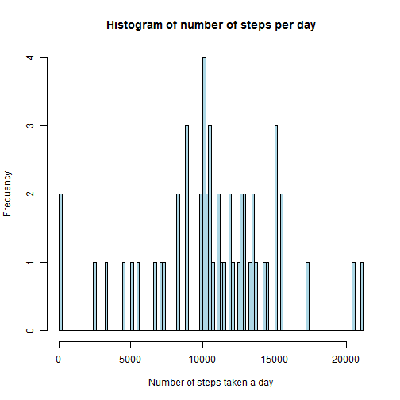

First assignment
========================================================

Since I have only joined this course on the last day of submission, I only had time to start this assignment. :(

First I read the activity.csv file:


```r
data = read.csv("activity.csv")
```

Than I plot the histogram and calculate mean and median:


```r
dataFactor <- as.factor(data$date)
stepsPerDay <- by(data$steps,dataFactor,sum, na.rm = F)

histogram = hist(stepsPerDay, breaks = 100)
```

 

```r
meanValue = mean(stepsPerDay, na.rm = T)
meanValue
```

```
## [1] 10766
```

```r
medianValue = median(stepsPerDay, na.rm = T)
medianValue
```

```
## [1] 10765
```


